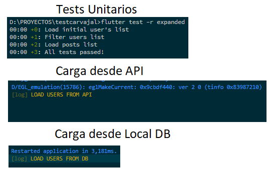

# Prueba Ceiba

Hola, mi nombre es <a href="https://www.linkedin.com/in/carlos-aguirre-t">Carlos Felipe Aguirre Taborda</a>, estoy aplicando para el cargo de **Flutter developer**.

Este repositorio contiene la app

## Contiene todas las funcionalidades indicadas incluyendo pruebas unitarias 

En caso de tener problemas al correr la app, configurar la ruta de JAVA en  `android/gradle.properties` la propiedad `org.gradle.java.home`